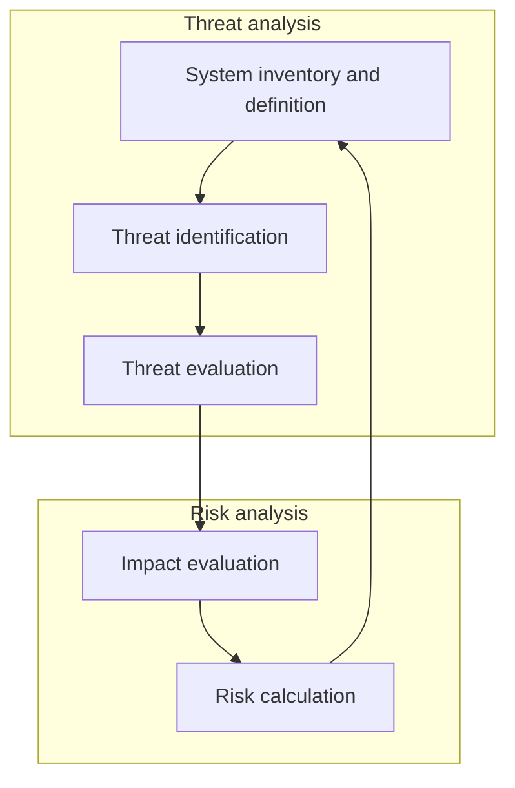
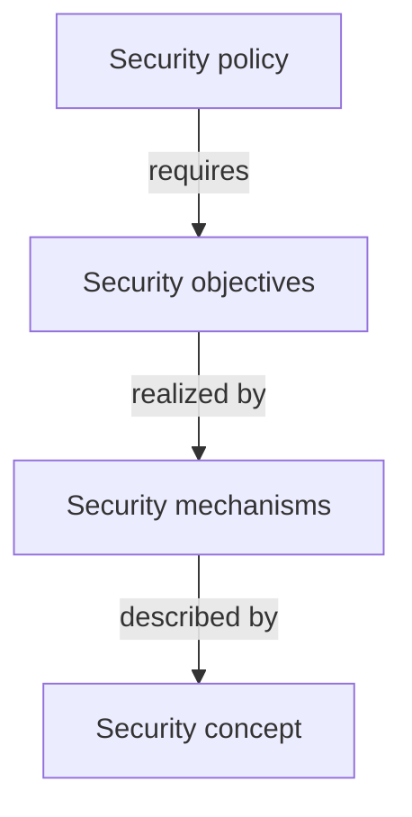

% Uni IT Security Notes
% Felicitas Pojtinger
% \today
\tableofcontents

# Uni IT Security Notes

> These study materials are heavily based on [professor Schmitz's "IT Security" lecture at HdM Stuttgart](https://www.hdm-stuttgart.de/mi/infoszumstudium/studium/schwerpunkte/it_security_htmldoc2).

## Basics

### Security Mindset

- Focus on weaknesses, not on features
- Don't rely on the "good case"
- Anticipate what an attacker could do to a system
- Weight security against user experience and privacy

### Aspects of IT Security

- Legal
- Technical
- Economical

### Security Objectives

- **Confidentiality**/`conf`
  - Nobody but the legitimate receiver can read a message
  - Third party cannot gain access to communication patterns
- **Integrity**/`int`: The contents of communication can't be changed without the participants knowing
- **Authenticity**/`authN`
  - **Entity Authentication**: Communication partners can prove their respective identity to one another
  - **Message Authentication**: It can be verified that a message is authentic (unaltered and sent by the correct entity)
- **Authorization**/`authZ`
  - Service or information is only available to those who have correct access rights
  - Depends on authentication being set up
- **Non-Repudiation**/`nRep`: A sender cannot deny having sent a message or used a service
- **Availability**/`avail`: Service is available with sufficient performance
- **Access Control**/`ac`: Access to services and information is controlled
- **Privacy**/`priv`
  - Restricted access to identity-related data
  - Anonymity
  - Pseudonymity

### Safety vs. Security

- **Safety**: Coincidental crashes or failures → On average more likely
- **Security**: Intentional attacks → Less likely

### Attacks, Threats and Vulnerabilities

- **Attacker**: A person who has the skill and motivation to carry out an attack: The steps needed to carry out an attack
- **Vulnerability**: Some characteristics of the target that can result in a security breach
- **Threat**: Combination of an attacker, an attack vector and a vulnerability
- **Attack**: A threat that has been realized and has caused a security breach
- **Attack Vector**: Some characteristics of the target system that can result in a security breach

### Risk and Threat Analysis



### Threat Identification

- Define **system boundaries**: What is part of your system, what is not?
- Define **security objectives**: What is important for your system to be secure?
- **List all threats** you can think of: Brainstorming and discussion with experts
- Use **conventions**:
  - Similar threat models
  - Requirement specifications
  - How to break or circumvent the specifications
  - Note security assumptions of the system
  - Be careful with perimeter security: What if perimeter has been breached?
  - Note _possible_, but not yet exploitable vulnerabilities

### Trade-offs in Security

- **Costs increase exponentially** with increased security
- **User friendliness decreases linearly** with increased security
- Risk analysis can be used when tuning the level of security

## Security Frameworks

### Network Specific Threat Examples

- Remote Attacks
- Eavesdropping: Sniffing of information
- Altering information
- Spoofing
- DoS
- Session hijacking
- Viruses attacking clients
- Spam
- Phishing
- Data trails/privacy leaks

### STRIDE: Attacks on a Multi-User System

- **S**poofing of Identity
- **T**ampering with Information
- **R**epudiation
- **I**nformation Disclosure
- **D**oS
- **E**scalation of Privileges

### Security Policies

- Classification of system states into "allowed" and "forbidden" states
- Secure system: Is only in allowed states
- Breached system: Is in forbidden state

### Security Mechanisms and Concepts



### Mitigation Strategies

- **Reduce**: Increase effort for attacker
- **Assign**: Decrease damage for target
- **Accept**: Accept remaining risk

## Malware

### Malware General Definition

- Performs unwanted functions
- Often runs without user's consent
- Telemetry (often hidden in proprietary software behind EULAs)
- Backdoors

### Infection Paths

- **Direct infection**: Mail → Executable
- **Exploitation of vulnerabilities**: Over network, drive-by infection (downloads which a person has authorized but without understanding the consequences)
- **External devices**: USB sticks
- **Bundled** with other functionality: Trojan horses

### Malware Types

- **Computer viruses**
  - **Boot sector** virus (infects all drives)
  - **File** virus
  - **Macro** virus
  - **Worm**: Network based virus
- Trojan horses; adware
- Key loggers, spyware
- Botnet software
- Ransomware: Extortion

### Trojan Horses

- Has server and client parts
- Server is used for installation, which the client then confirms
- Once installed, an attacker can take control
  - Reading sensitive data
  - Key logging
  - Botnet integration

### Backdoors

Intentionally created remote code execution vulnerability/ingress into system (_Hello, Five Eyes!_).

### Logic Bomb

Malicious function, which is called once condition evaluates to true.

### Rootkit

Collection of services installed on a compromised system, which enables hiding ...

- Logins
- Processes
- Files

from users other than `root`.

### Advanced Persistent Threat

**Advanced**:

- Attack is customized to target host (one node)
- High effort
- Targets are i.e. VIPs or institutions

**Persistent**:

- First infected host is used to infiltrate the entire system
- Scans for login information to create an account for the attackers

**Threats**: Often uses Zero-Day vulnerabilities

### Botnet

- Infected host does work for somebody external
- Master controls the bots and distributes updates to stay hidden
- Dynamic: Needs to handle hosts being turned on/off and has to hide its existence
- Can be used to send spam, DDoS attacks, hosting of malicious sites

### Common Reasons for Vulnerabilities

Issues in ...

- Architecture
- Design
- Implementation

... lead to attack vectors:

- **Client side**: Browser, office software, E-Mail, media players, ...
- **Server side**: Web apps, OS services, Anti-virus/backup software
- **Relaxed security policies**: User has to many capabilities
- **Abuse of protocols**: Instant messaging can be used as remote control, BitTorrent for distribution etc.
- **Zero-day attacks**: Non-public vulnerabilities

### Side-Channel Attacks

Indirect (physical) attack on a system; i.e. smudge patterns on a smartphone

### Buffer Overflow

- Application provides finite buffer for input but does not check size of input
  - Buffer can overflow
  - Overwriting internal information or allowing attacker to insert machine code to jump back into
  - Possible due to Von Neumann architecture: Programs in data are stored in the same memory
  - C does not check bounds (`gets`, `strcopy`, `memcopy`, `prinf` etc.)

### Race Conditions

Information is being changed after it has been checked, but before it has been executed.

## Networking

Videos### TCP Overview

- Characteristics
  - Reliable
  - Connection-Oriented
  - Full-Duplex
  - Layer atop IP
  - Connection management: Setup, Release and Abort
  - Ordered delivery (package sequence control)
  - Repetition of lost packets
  - End-to-End ACKs
  - Checksum in header
- Identified by a 5-tuple
  - Source IP
  - Destination IP
  - Transport Protocol
  - Source Port
  - Destination Port

### TCP Connection Establishment

- Virtual connection between two systems
- 3-Way-Handshake with connection states

An example connection from the client to the server:

```plaintext
<Client>                                              <Server>

[Closed]                                              [Closed]
                  SEQ=x     CTL=SYN               =>
[SYN Sent]
              <=  SEQ=y     CTL=SYN+ACK   ACK=x+1
                                                      [SYN Received]
                  SEQ=x+1   CTL=ACK       ACK=y+1 =>
[Established]                                         [Established]
```

### IP Security Issues

- IP header doesn't have confidentiality or integrity protection
  - Faking the sender address is easy to do
  - Traffic can be analyzed by sniffing packet headers
- IP payload doesn't have confidentiality or integrity protection
  - Eavesdropping is possible by sniffing packets
- Loose coupling with lower layers:
  - Easy to divert traffic
  - Availability can be easily attacked
  - Confidentiality and integrity can't be guaranteed
- Unprotected error signaling via ICMP: Fake error messages can affect availability
- DNS is insecure; i.e. DNS spoofing

### TCP Security Issues

- TCP header doesn't have confidentiality or integrity protection
- **Session hijacking**
  - When sniffing session details, attacker can impersonate a peer in a TCP connection
  - Attackers can guess session details and attack remotely using spoofed IP addresses
- **RST attack**: Attackers can reset/abort attacks by injecting packets with the RST flag
- **Port scanning**
  - Find out open ports
  - Determine software running on port
- **SYN flooding**
  - Overload system resources by initializing many connections and not pursuing them

### Port Scanning

- Objective: **Collect information** about ...
  - Installed services
  - Software versions
  - OS
  - Firewall
- Enumeration based on port
  - Well-known ports (i.e. SSH → 22)
  - Invalid connection requests: Different way of error handling can be used to fingerprint the OS
- Possible scanning methods
  - **TCP connect** scan
  - **Half-open** scan
  - **SYN-ACK** scan
  - **ACK** scan

### TCP Protection Mechanisms

- SYN flood protection
  - Limit rate of SYN packets
  - SYN cookies (RFC 4987)
    - Limit resources
    - Half-open connections are not stored in the connection table but instead as a hash in the ISN
    - Only if the 3rd ACK handshake packet matches the sequence number, the connection is added to the connection table
    - Server does not need to maintain any state information on half-open connections: Resources can't be exhausted
- Connections are only accepted if the sequence numbers are within a certain range of acceptable values (attackers would have to sniff sequence numbers or guess them)

### Session Hijacking

- Attacker takes over existing connection between two peers
- Requirement: Attacker has to sniff or guess sequence numbers of the connection correctly

### RST Attacks (In-Connection DoS)

Inject packet with RST flag into ongoing connection: Connection has to be aborted immediately

### Blind IP Spoofing

Firewall is configured to only allow one source IP address and destination IP address (A → B).

To circumvent this restriction:

1. Attackers starts DoS attack on A to prevent A from sending RST packets to B
2. Attacker sends TCP connection setup packet with A's source IP address to B
3. B sends SYN+ACK packet to A, but can't respond due to DoS
4. Attacker sends TCP connection ACK packet to B with ACK matching the initial sequence number chosen by B (which has to be guessed, as B sent the SYN+ACK packet to A, not the attacker)

Only works if B uses a predicable algorithm for it's ISN and packet filters aren't in place.

## Perimeter Defense in Practice

### Architecture Recommendations

- Known from medieval cities, castles etc.
- Definition of system boundary between "inside" and "outside"
- Different threat models for inside and outside
  - **Inside**: Trusted
  - **Outside**: Untrusted
- Objectives
  - Create said boundary
  - Only a defined set of communication relations is allowed
  - Special security checks
  - Limited number of interconnection points
  - Simpler to manage and audit than a completely open architecture
- Problems
  - Requires intelligent selection of system boundaries
  - May require multiple levels of perimeters
  - No system/user in the "trusted inside" can truly be trusted

### Application in Networking

- Installing security devices at the network border
- Seperation of network areas into inside/outside
- Prevent sensistive information from being sent to the outside (view the system in the inside as the potential, probably unintentional attacker)
- Multiple levels can increase security
- But: Perimeter security is not sufficient on its own!
  - The will probably be additional non-secured paths into the network (i.e. `ssh -R`)
  - Some malicious traffic might look like "normal" traffic and can pass

### Stateless Packet Filter

- Access Control List (ACL): Applies set of rules to each incoming packets
- Discards (denies, blocks) or forwards (allows, permits) packets based on ACL
- Typically configured by IP and TCP/UDP header fields
- Stateless inspection: Established connections can only be detected with the ACK control flag
- Can be easy to misconfigure by forgetting essential protocols
  - DNS
  - ICMP
- Advantages
  - Fast/High throughput
  - Simple to realize
  - Software-based, can be added as a package
  - Simple to configure
- Disadvantages
  - Inflexible
  - Many attacks can only be detected using stateful filtering
  - Rules and their priorities can easily get confusing
- Default discard policy
  - Block everything which is not explicitly allowed (allowlist)
  - Issue: The security policy has to be revised for each new protocol or service
  - This rule must come last/have the lowest priority, behind all "allowing" rules

### Stateful Packet Filters

- Store connection states
- Can make decisions based on
  - TCP connections
  - UDP replies to previous outgoing packet with same IP:Port relation ("UDP Connection")
  - Application protocol states
- Similar to application layer gates/proxy firewalls, but less intruding in communication
- Rules can be more specific than in stateless packet filters
- Rules are easier to enforce, i.e. incoming TCP packets don't have to be allowed in because they have ACK set

### Stateful Firewalls

- Tries to fix the problems of stateless inspection
  - To many packets have to be allowed by default (ACK → No SYN-scanning protection)
  - Protocols like FTP or SIP, which dynamically allocate port numbers, can't be filtered securely
- Create state per TCP or UDP flow
  - Source and Destination IP:Port
  - Protocol
  - Connection state
- A packet which is not associated with a state is dropped immediately
- Packets which belong to a previously established TCP/UDP "connection" are allowed to pass without further checks
- State tables have to be cleaned up periodically to prevent resource starvation

### Application Layer Proxies

- Protected host during connection establishment
- Different kinds
  - Application level
  - Circuit level
  - Forward proxy (client-side)
  - Reverse proxy (server-side)

### Application Level Gateways

- Conversion between different application layer protocols
- Evaluation up to OSI layer 7
  - Protocol verification
  - Authentication
  - Malware scanning
  - Spam filtering
  - Attack pattern filtering
- Advantage: Security policies can be enforced at application level
- Disadvantage: Computing and memory performance requirements

### Circuit Level Gateway

- Checks/controls at TCP connection level
- Creates separate connection to outside and inside
- Checks data before it is being sent to the transport layer

### Demilitarized Zone (DMZ)

- **Outside world**: Global Internet
- **Outside router**: Routes packet to and from bastion host
- **Bastian host**: Proxy server and relay host
- **Inside router**: Routes packets only to and from bastion host
- **Inside (protected)**: Intranet

The DMZ creates 2/3 lines of defense by the use of a stub network.

Multi-Level DMZs can create even more secure perimeter defenses:

Global Internet → Access Router and Packet Filter → Public Services Host (offers i.e. public Web services) → Screening Router and Packet filter (prevents IP spoofing) → Mail host (for external mail communication) → Bastion host (i.e. proxy for FTP and Web access) → Intranet

### Web Application Firewalls (WAFs)

- Acts on the application layer
- Is a reverse proxy
- Can protect the web server from "evil" client input
  - Cross-Site scripting
  - SQL injection: Filters out JS or SQL commands in client input by removing special symbols (i.e. `<`, `'` etc)
  - Cookie poisoning: Stores the hash values of sent cookies
  - HTML manipulation: Encrypts URL parameters

### Cross-Site Scripting (XSS)

Injection of malicious client-side code (JS, WASM) into site. There are multiple types:

- **Reflected/non-persistent XSS**: Attacker provides malicious data i.e. via URL → server adds malicious code to page → browser executes the malicious code
- **DOM-based XSS**: Attacker provides malicious data i.e. via URL → client (app running in the browser) adds malicious code to page → browser then executes the malicious code
- **Stored (persistent) XSS**: Attacker provides malicious data using i.e. their profile page, `POST`s it to the server → server stores it i.e. in a database → Client then requests i.e. the attacker's profile page → server loads the malicious data from the database → adds the stored malicious code to the page → browser then executes the malicious code

### Cross Site Request Forgery (CSRF)

Sniffing of cookies/tokens from a connection in another tab.

### Intrusion Detection Systems (IDS)

- Security product that is specialized on detecting anomalies during live operation of networks and computers
  - Virus/Botnet activity
  - Suspicious network activity (malware phoning home)
- Basic Approaches
  - **Signature based**: Use attack signatures/known malicious communication activity patterns
  - **Anomaly based**: Significant deviation from previously recorded baseline activity
  - **Rule based**: Define allowed by behavior by app-specific set of legitimate actions
- Actions
  - Send out alarm
  - Logging
  - Blocking of known patters
- Realization
  - Appliance
  - Integration in firewall
  - Integration into host

### Injections

- **SQL injection**: SQL commands are sent to the database because neither server nor client escape i.e. `'`
- **HTML injection**: Parameters in HTML forms can also be sent using a `POST` request

## Symmetric Encryption

### Symmetric Encryption Overview

**Alice**:

1. Creates message
2. Chooses key
3. Computes ciphertext
4. Send ciphertext to Bob

**Eve** (Attacker):

1. Copies ciphertext
2. Tries to guess the key

**Bob**:

1. Receives ciphertext
2. Uses key
3. Computes plaintext
4. Reads message

### Kerckhoffs' Principle

- From "La Cryptographie Militaire"
- Most important point: **The security of a crypto system must lie in the non-disclosure of the key but not in the non-disclosure of the algorithm**
- Implementation
  - Keep secret which function you used for encryption
  - But a disclosure of the set of functions should not create a problem

### Strong Algorithms

- There is **no attack that can break it with less effort than a brute force attack** ("complete enumeration")
- There are so many keys that a **complete search of key space is infeasible**

### Crypto Attack Classes

- **Active** attacks
  - Most relevant for cryptographic protocols
  - Active interference (modification, insertion or deletion of messages)
  - Man in the middle (MITM) can receive messages and modify them on the way to the receiver
- **Passive** attacks: Pure eavesdropping, without interference with communication

### Perfect Security

Ciphertext does not give any information you don't already have about the plaintext ($p(m(c))=p(m)$)

### One-Time-Pad

- **Vernam Cypher**: Create ciphertext by XOR addition of secret key and plaintext
- **Mauborgne**: Random key, never re-use key ("one time")
- **Shannon**: OTP is unbreakable if key is ...
  - Truly random
  - As large
  - Never reused
  - Kept secret

### Stream Cyphers

Encryption like one-time-pad, but using pseudo-random bits instead of true random (using a **Crytographically Secure Pseudo-Random Number Generator (CSPRNG)**)

### True Random Number Generators

- Output can't be reproduced or predicted
- Is based on physical processes

### (Cryptographically Secure) Pseudo-Random Number Generators (CSPRNG)

PSRNGs compute the output based on a seed and an internal state.

A CSPRNG must ...

- Be unpredictable
- Be computationally infeasible to compute the next outputs

... when the initial state of the CSPRNG is not known

### Design Principles for Block Cyphers

Two methods for frustrating a statistical analysis:

- **Confusion**: The ciphertext should depend on the plaintext in such a complicated way that an attacker cannot gain any information from the ciphertext (redundancy should not be visible anymore in the ciphertext)
- **Diffusion**: Each plaintext and key bit should influence as many ciphertext bits as possible
  - Changing one bit in plaintext → Many pseudo-random changes in ciphertext
  - Changing one bit in the key → Many pseudo-random changes in ciphertext

### Feistel Networks

- Described by Horst Feistel
- Algorithm
  - Plaintext block B is divided in 2 halves
  - Derive r round key keys from key
  - Feed one half through round function F
  - Then XOR the result with the other half
  - Exchange halves
- Repeat r times

### DES (Tripple DES)

- Single DES breakable in less than 24h (complete search of key space)
- Tripple DES is still secure
- Three steps of DES on each data block using up to three keys
- Decryption in reverse sequence
- 3 independend keys are the most secure
- Three same keys can be used for (insecure) DES compatibility

### AES Key Features

- FIPS standard 197
- Key length: 128/192/256 bit
- Block size: 128 bit
- Iterative rounds of substitutions and permutation, but no Feistel structure
- 10, 12 or 14 rounds
- Blocks of 16 bytes arranged in 4x4 state matrix
- Components of the round function are invertible and independent of key
  - **Substitute Bytes**: Non-linear substitution of bytes in state
  - **Shift Rows**: Cyclic shifting of rows
  - **Min Columns**: Multiplication of state elements with a fixed 4x4 matrix M

### Modes of Operation for Block Cyphers

- Objective: Encrypt multiple plaintext blocks with the same block cypher
- Straightforward solution: blockwise encryption ("Electronic Codebook Mode")
- Problem: Patterns in the distribution of plaintext blocks remain visible

### Cypher Block Chaining (CBC)

- Avoids telltale patterns in ciphertext
- Decryption fails if a data block is missing or corrupted
- Each data block is encrypted in relation to the previous block

### Counter Mode (CTR)

- Simple and efficient
- Random access still possible
- No issues if data block is missing
- Incrementing counter is involved in randomization per data block

### Padding

- Plaintext needs to be a full number of blocks
- If plaintext does not fill the last block completely, it must be padded before encryption
  - In order to facilitate safe decryption, the last block is always padded: For example for a block size of n bytes, there are 1...n bytes added to the plaintext before encryption
  - Decryption can check last bytes and strip them off correspondingly
- Always need to pad with at least one byte!
- Common methods
  - Pad with bytes of the same value as the number of padding bytes (PKCS#5; i.e. if there are three bytes to be padded, add `0x03 0x03 0x03`)
  - Pad with `0x80` followed by `0x00` bytes
  - Pad with zeroes except for the last byte that indicates the number of padding bytes
  - Pad with zeroes
  - Pad with space characters (`0x20`)

### Key Length Considerations

- Cryptography is always a matter of complexity
  - With enough time and/or space, all schemes can theoretically be broken
  - "brute force" attacks
  - Example: 56bit keys DES can be broken in \<24h since 1999
- Meanwhile
  - 128bit keys have to be replaced in the coming years
  - 192bit keys are secure in medium term
  - 256bit keys are hard to crack due to physical boundaries ("state of the art")
- Quantum computers might be able to crack keys much more quickly
- Numbers refer to unbroken algorithms in symmetric cryptography
  - Broken algorithm is one where an n bit key can be determined trying out significantly less than 2^n^ keys

## Message Authentication

### Message Authentication Codes (MACs)

- Objectives
  - **Integrity protection**: Prevent unauthorized manipulation of data
  - **Message authentication**: Prevent unauthorized origination on behalf of others
- Idea: Compute a cryptographic chesum (MAC)
- Required Properties
  - Cannot be counterfeited; without having the sender's secret, it is to complex to ...
    - Find another message matching the same MAC
    - Construct a suitable MAC for another message
  - Even smallest changes to message cause a big change of the MAC

### General Scenario

**Alice**:

1. `m = "I love you. Alice"`
2. Select secret key $K$
3. Compute $MAC_K(m)$

**Bob**:

1. Receives `m'`
2. Selects secret key $K$
3. Computes $MAC_K(m')$
4. Compares computed MAC with received MAC → Matches!

**Assertion**: If computed MAC equals the MAC included in the received message, an owner of the key (Alice) really sent this message and it was not changed on the way.

### Scenario with Modified Message

**Alice**: Same as in [General Scenario](#general-scenario)

**Mallory**:

- `m = "It's all over! Alice."`

**Bob**

1. Receives `m'`
2. Selects secret key $K$
3. Computes $MAC_K(m')$
4. Compares computed MAC with received MAC → Doesn't match!
5. Ignore `m`

### MAC Computation

- Requirements
  - Shared key k between sender and receiver
  - Hash function to create a code that changes if the message has been altered
- Using **block cypher** $f_k$ and **hash function** $hash$: $MAC(m)=f_k(hash(m))$
- Using a **key dependent cryptographic hash function** $hash(k,m)$: $MAC(m)=hash(k,m)$

### Hash Function Requirements

- Weak **collision resistance**: For a given message and hash it is impossible/to complex to find another message such that the hashes match
- **One-way** property
  - Easy to compute hash
  - Impossible to find message from hash

## Asymmetric Encryption

### Public Key Cryptography

**Alice**:

1. Generates key pair $(PK_{Alice},SK_{Alice})$
2. Published $PK_{Alice}$ at Trent's
3. $c$ received → decrypts $m=D_{SK_{Alice}}(C)$

**Trent**:

- Stores public keys
- Provides public keys on request

**Bob**:

1. Wants to send $m$ to Alice confidentially
2. Obtains $PK_{Alice}$ from Trent
3. Computes $c=E_{PK_{Alice}}(m)$
4. Sends $c$ to Alice

### RSA Key Generation

> Also see the [handwritten notes](static/rsa_computation.pdf).

1. Alice chooses 2 large prime numbers $p, q$ and computes $n=p \cdot q$, $\phi(n)=(p-1)(q-1)$
2. Alice chooses an integer $e$ with $1<e<\phi(n)$ that is relatively prime to $\phi(n)$
3. Alice computes an integer $d$ with $1<d<\phi(n)$ and $d \cdot e = k \cdot \phi(n) + 1$
4. Alice publishes her public key $PK_{Alice}=(e,)$
5. Alice keeps her private key $SK_{Alice}=d$ and $p$, $q$, $\phi(n)$ secret

### RSA Encryption

> Also see the [handwritten notes](static/rsa_computation.pdf).

1. Bob obtains $PK_{Alice}=(e,n)$
2. Bob composes plaintext $m \in M=\{1,2,...,n-1\}$
3. Bob computes the ciphertext $c=E_{PK{Alice}}(m)=m^e\mod n$
4. Bob sends $c$ to Alice

### RSA Decryption

> Also see the [handwritten notes](static/rsa_computation.pdf).

Alice can obtain the plaintext message $m$ by computing $m=D_{SK_{Alice}}(c)=c^d\mod n = m^{ed} \mod n$

### RSA Security

- **RSA problem**: Given $e$, $n$ and $c = m^e \mod n$, find $m$
  - Most efficient approach to solve the RSA problem is currently the integer factorization of $n$: An upper limit to the complexity of the problem; can be used to derive the private key from the prime factors
  - Quantum computers will be more efficient in doing integer factorization (Shor's algorithm)
  - RSA problem and integer factorization still lack mathematical proof for their complexity
- **Organizational properties**
  - **Authenticity** of the public key $(e,n)$
  - **Confidentiality** of the secret key $(d,p,q)$
- **Mathematical properties**
  - **Complexity of factoring** the modulus $n$
  - **Complexity of solving** the RSA problem
- Failure of any properties will compromise the security of the method!

### Hybrid Method

Combination of asymmetric and symmetric key methods.

**Alice**:

1. Generates key pair $(PK_{Alice}, SK_{Alice})$
2. Publishes $PK_{Alice}$ at Trent's
3. $c$ received → Decrypts $K=D_{SK_{Alice}}(c)$
4. Alice and bob switch over to the symmetric key algorithm with key $K$

**Trent**:

- Stores public keys
- Provides public keys on request

**Bob**:

1. Obtains $PK_{Alice}$ from Trent
2. Generates symmetric key $K$
3. Computes $c=E_{PK_{Alice}}(K)$
4. Sends $c$ to Alice

### Discrete Logarithms

**Primitive element**: Let $p$ be a prime number. An element $g\leq p-1$ is called primitive element $\mod p$ if for each $A \in \{1,2,...,p-1\}$ there is an $x$ such that $A=g^x \mod p$

**Discrete logarithm**: Let $p$ be a prime number and let $g \leq p-1$ be a primitive element $\mod p$. Then an element $x$ is called discrete logarithm of $A$ to base $g \mod p$ if $A=g^x \mod p$.

**Discrete logarithm problem**: Given $A$, $g$, $p$, find $x \leq p-1$ with $A=g^x \mod p$

### One-Way Functions

- "Trap-door" functions
- Easy to compute in one direction (i.e. $f(x)=g^x \mod p$)
- Hard to invert
  - Ideally only possible using complete enumeration of all possible inputs
  - I.e. for a given $y$ you need to try out all possible values $x=0,1,...,p-1$ to find one $x_0:f(x_0)=y$
- Definition of complexity often of the P and NP complexity classes
  - **P**: Answer of a problem can be found in polynomial time ($b$ bits of problem size → algorithm takes time $b^k$)
  - **NP**: Answer of problem cannot be found in polynomial time ($b$ bits of problem size → algorithm takes time $k^b$), but the correctness of given answer can be checked in polynomial time

### Diffie-Hellman Key Exchange Protocol

**Purpose**: Allow communication partners without prior knowledge of another to establish a shared secret key over an insecure communication channel

> Also see the [handwritten notes](static/diffie_hellman_exchange_computation.pdf).

1. Alice and Bob agree publicly on prime number $p$ and a primitive element $g \leq p-1$
2. Alice randomly chooses $\alpha \in \{2,...,p-2\}$ and computes $A=g^\alpha \mod p$
3. Bob randomly chooses $\beta \in \{2,...,p-2\}$ and computes $B=g^\beta \mod p$
4. Alice and Bob publicly exchange A and B
5. Alice and Bob hold a common secret key $K$:
   1. $K_B=A^\beta \mod p=g^{\alpha \beta} \mod p$
   2. $K_A=B^\alpha \mod p=g^{\alpha \beta} \mod p = K_B$

### Diffie-Hellman Key Exchange Protocol Security

It depends on three properties which can't be relaxed:

- **Discrete logarithm problem**: There is no efficient inversion for integer exponentiation
- **Authenticity** of exchanged messages: No protection against MITM attacks!
- **Diffie-Hellman problem complexity**: Given $g, p, A=g^x \mod p, B=g^y \mod p$ find $K=g^{xy} \mod p$

## Trust

### Digital Signatures

- Requirements
  - **Tamper-proof**
  - **Unambiguous attribution** of signature to signing person/identity
  - **Inseparable connection** between signature and signed document
  - **Non-repudiability** of signature
- Typical approach
  - Encrypt hash of document with secret key
  - Signature can be verified using the public key

**Alice**:

1. Generates key pair $(PK_{Alice}, SK_{Alice})$
2. Publishes $PK_{Alice}$ at Trent's
3. Computes $sigAlice(m)=E_{SK_{Alice}}(hash(m))$

**Trent**:

- Stores public keys
- Provides public keys on request

**Bob**:

1. Obtains $PK_{Alice}$ from Trent
2. Computes $hash(m_{received})$
3. Decrypts signature $D_{PK_{Alice}}(sig_{received})$
4. Compares $hash(m_{received})$ to the received signed hash

### RSA Signatures

- Conventions
  - $PK_{Alice}=(e,n)$
  - $SK_{Alice}=d$
  - $m$ is the message to be signed
  - $h$ is the secure hash function
- **Computation** of signature: $sig_{Alice}(m)=(h(m))^d \mod n$
- **Verification** of signature
  - Bob receives $(m', sig')$
  - Bob computes $h(m')$ and $(sig')^e \mod n$
  - If both match, the signature is verified

### Certificates

- A certificate (cert) certifies that a certain public key belongs to a certain identity ("person")
- Certificates are digitally signed by service providers (Certificate Authorities, CAs) or government agencies (i.e. COVID certs)
- **X.509**: ITU standard for a common certificate format; contains
  - Version (v3)
  - Serial number (unique within the CA)
  - Signature algorithm
  - Issuer name (name of the CA)
  - Time of validity (not before, not after)
  - Subject name (who the cert is for)
  - Subject public key info (public key of subject, algorithm of public key)
  - ID of signature algorithm
  - Certificate signature algorithm
  - Certificate signature value (signature of the CA which signs the cert)

## Transport Security

### Internet Model

- 7: Application Layer: HTTP, SMTP, ...
- Between: TLS, SSH, ...
- 4: Transport Layer: TCP, UDP, ...
- 3: Internetwork Layer: IP
- 2: Data Link Layer: IEEE 802.x
- 1: Physical Layer: IEEE 802.x
- (0): Physical transmission medium: Wire, fiber, wireless

### TLS Handshake Overview

```plaintext
title TLS Handshake

Client->Server: Hello
Server->Client: Hello
Server->Client: Cert public key
Server->Client: Hello Done

note over Client: Pre-master secret
note over Client: Symmetric key

Client->Server: Change cypher key exchange
Client->Server: Client finished

note over Server: Pre-master secret
note over Server: Symmetric key

Server->Client: Change cypher sec
Server->Client: Finished

Client<->Server: Encrypted data transfer
```

### TLS Record Protocol

**Sender**:

1. Fragmentation
2. Compression (optional)
3. MAC computation (Key dependent; MD5, SHA-1, SHA-256 etc.)
4. Encryption

**Receiver**:

1. Decryption
2. MAC verification
3. Decompression (optional)
4. Reassembly

### Connection States

- Each side has four connection states
  - One for each direction (read/write)
  - One current and one pending set of states
    - Parameters negotiated by the TLS handshake protocol
    - Pending states made current by the change cypher spec protocol
- Security parameters
  - Connection end (client/server)
  - Bulk encryption algorithm
  - MAC algorithm
  - Compression algorithm
  - Master secret
  - Client random
  - Server random
- Security items for both directions (client write/server write)
  - Encryption keys
  - MAC secrets
  - Initialization vectors (in case of block cypher)
  - Sequence numbers (no wrapping)

### SSH Transport Layer Protocol

- Tasks
  - Server authentication
  - Negotiation of algorithms and keys
  - Confidentiality and integrity protection (for application data)
- Prerequisites
  - Server has a public key ("host key")
  - Client has a trustworthy copy of the host key
  - Reliable transport protocol (TCP) between client and server

## Frequently Asked Questions

### Phishing Attacks

- Attacker tries to get a user to log in with a fake mail and a fake site
- Attacker steals the login information of the user in order to get access to bank accounts or credit card info
- Many options in addition to mail
  - Malware (Keylogger)
  - DNS-based phishing (Redirection to fake site)
  - Man-in-the-middle Phishing
  - XSS
- Violated security objectives
  - **Authenticity**: Attacker pretends to be a different company
  - **Confidentiality**: Non-secured connection
  - **Authorization**: The attacker can steal credentials
  - **Privacy**: The attacker can get identity-related info by access to the user's account
  - **Non-repudation**: The attacker can transfer money

### Phishing Attack Prevention

- Spam filters: Most phishing mails can be filtered using a spam filter
- A link's text should be compared to the actual URL (the `href` tag)
- Check the URL in the address bar
- Antivirus-Apps
- Using an up-to-date system
- Checking the certificates of a site
- Using HTTPS

### Certificates and CAs

- Certifies properties of people or objects and their authenticity and integrity using cryptographic processes
- A public key certificate provides the public key of a person or organization and confirms it
- Certificates are signed by the service provider/certificate authority (CA) or a government authority (i.e. COVID-19), which adds to trust

### Certificate Revocation

- As soon as a cert's private key has been leaked, it needs to be revoked by putting it on a certificate revocation list
- Before a cert should be used it should be checked if it has not been revoked yet
- There are also other reasons for cert revocation
  - Change of certificate metadata (i.e. name change)
  - Dissolution of the organization
  - Removal of privileges

### Validation of Certificates

- Certificate has the service provider's/CA's signature
- The signature is a hash of the certificate encrypted with the CA's private key, which can be validated by decrypting it with the CA's known public key
- Date validity needs to be checked
- Revocation needs to be checked
- Risks
  - Revocation checks are crucial because they allow a user to verify the identity of the owner of the site and discover whether the certificate authority still considers the digital certificate trustworthy
  - Attacker could fake a site using a revoked certificate

### Why can DES be decrypted even though `F` is not invertible?

- Key is divided and only one half is put through the round function
- Both halves are joined using `XOR`
- In order to decrypt a block, the same algorithm is used, but the divided keys are used in the opposite order

### SQL Injection

- Inputs from forms, API requests etc. are passed to the database without any validation for embedded snippets
- Embedded SQL snippets will run on the DB, allowing the attacker to run any snippet on the database
- Violated security objectives
  - **Authorization**: Access is granted without authorization
  - **Confidentiality**: Access to info in database
  - **Integrity**: Data can be manipulated
  - **Privacy**: Access to potentially identity-related private info
  - **Availability**: Database could be dropped, which would take the system down (no schema after attack)

### DNS Spoofing

- Attacker sends fake DNS answers and pretends to be the relevant nameserver
- Attacker needs to send the fake answer before the relevant nameserver can; this is for example possible by a DoS attack
- Attacker can also add a fake entry to `/etc/hosts`
- Violated security objectives
  - **Authenticity**: Attacker pretends to be someone else
  - **Confidentiality**: Attacker eavesdrops on communication with DNS server

### Replay Attacks and Signatures

- Attacker tries to communicate using a packet which they sniffed beforehand
- Can be provided by using a random number or nonce, which is also being encrypted; the number would have to be guessed
- Encryption and signatures don't help prevent replay attacks as decryption is not required to replay the attack
- Violated security objectives
  - **Confidentiality**: Third parties shouldn't have access to the communication
  - **Authenticity**: Attacker can pretend to be someone else
  - **Authorization**: If sniffed packet contains login info

### VPN Access from Intranet to external Mail Server

- VPN gateway is required
- IPSec tunnel mode can be used
- Firewall rules, VPN connection and routing tables need to be configured

### Stateless vs. Stateful Packet Filters/Firewalls

- **Stateless**: Decides what to do with packets based on static values
  - IP:Port of source/destination
  - TCP flags
- **Stateful**: Decides what to do using a state table
  - Keeps track of connections using a state table (new/established/related/...)
  - Can detect MTU changes and packet fragmentation
  - Can't secure application layer from viruses
  - Decides what to do with packets based on dynamic values
    - TCP connections
    - UDP replies to previous outgoing packet with same IP:Port relation ("UDP connection")
    - Application protocol states
  - Drops unsolicited requests: Packets which don't match known criteria or are part of a DoS attack
